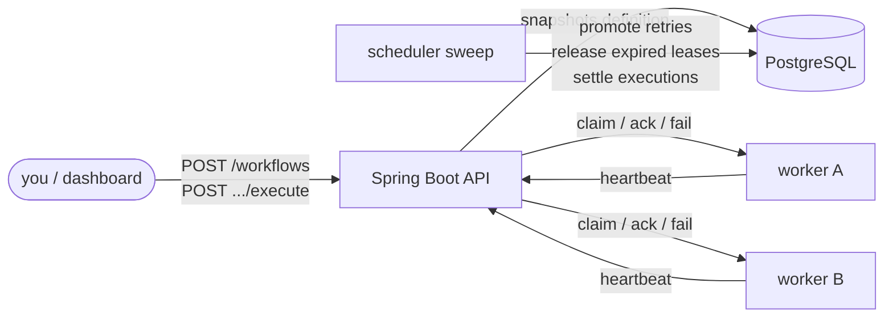

# FlowForge

[](https://aws.amazon.com/corretto/)
[](https://spring.io/projects/spring-boot)
[](https://www.postgresql.org/)
[](#testing)
[](LICENSE)

Fault-tolerant distributed workflow execution engine. Define DAG workflows,
run them across pull-based workers, survive worker crashes via lease recovery,
retry with exponential backoff — all state transitions as atomic Postgres
compare-and-swaps, no distributed locks, no external queue.

```bash
docker compose up -d            # postgres
mvn package -DskipTests
java -jar target/flowforge-1.0.0.jar
./scripts/demo.sh run           # payment crashes on attempt 1 → engine recovers → COMPLETED
```

## How it works



- **DAG execution** — roots start `READY`; a task becomes `READY` when every dependency is `SUCCESS`. Each execution pins an immutable definition snapshot, so redeploys never mutate in-flight runs.
- **Pull scheduling** — workers claim the highest-priority `READY` task. A claim is one `UPDATE … WHERE status='READY'` plus a fresh lease UUID; concurrent claimants serialize on the row, exactly one wins.
- **Crash recovery** — every claim carries `leaseOwner` + `leaseExpiresAt`. The sweep re-arms `RUNNING` tasks whose lease expired; a dead worker's late ack is rejected by the `(leaseOwner, attempt)` predicate.
- **Retries** — failure parks in `RETRY_WAIT` until `min(initial·2^(N−1), max)`, then `DEAD_LETTER`, which fails the execution. Defaults: 2s → 4s → …, 3 attempts.
- **Exactly-once recorded effects** — outputs are first-writer-wins keyed by `(execution_id, task_id)`; a re-claimed attempt replays the recorded output instead of re-running the side effect.

See [TECHNICAL.md](TECHNICAL.md) for the failure-model analysis and deliberate omissions.

## API

| Method | Path | Description |
|---|---|---|
| POST | `/workflows` | Create a workflow (auto-versioned; body = definition JSON) |
| GET | `/workflows` | List all workflow versions |
| POST | `/workflows/{id}/execute` | Start an execution (pins the definition snapshot) |
| GET | `/executions/{id}` | Execution detail: task rows + event log |
| POST | `/executions/{id}/cancel` | Graceful cancel (drains running tasks) |
| GET | `/workers` | Registered workers + health |
| POST | `/workers/register` | Worker self-registration |
| POST | `/workers/{id}/heartbeat` | Keep-alive |
| POST | `/workers/{id}/claim` | Pull the next READY task (204 when idle) |
| POST | `/workers/{id}/tasks/{teId}/ack` | Mark SUCCESS (`leaseOwner`, `attempt`, `output`) |
| POST | `/workers/{id}/tasks/{teId}/fail` | Report failure (`leaseOwner`, `attempt`, `error`) |
| GET | `/stats` | Dashboard aggregates: executions, tasks, workers, recent failures |

Definition shape:

```json
{
  "name": "order-processing",
  "tasks": [
    {"id": "payment", "type": "HTTP", "priority": 10},
    {"id": "shipping", "type": "HTTP", "dependsOn": ["payment"],
     "maxAttempts": 5, "params": {"sleepMs": 200}}
  ]
}
```

## Configuration

Everything lives under `flowforge.*` in `src/main/resources/application.yml`
and is overridable by environment:

| Variable | Default | Meaning |
|---|---|---|
| `FF_DB_URL` / `FF_DB_USER` / `FF_DB_PASSWORD` | `jdbc:postgresql://localhost:5432/flowforge` … | Postgres connection (Flyway migrates on boot) |
| `SERVER_PORT` | `8080` | HTTP port (`7860` in the container image) |
| `FLOWFORGE_SCHEDULER_LEASE_DURATION` | `30s` | Lease granted per claim |
| `FLOWFORGE_SCHEDULER_SCAN_INTERVAL_MS` | `1000` | Sweep cadence |
| `FLOWFORGE_RETRY_INITIAL_BACKOFF` | `2s` | Base backoff (capped at 60s) |
| `FLOWFORGE_WORKER_SERVERURL` | `http://localhost:8080` | Engine URL the embedded worker calls |
| `flowforge.worker.enabled` | `true` | Set `false` for a pure server node |

## Testing

```bash
mvn test   # unit + Testcontainers Postgres integration tests (32 tests)
```

Covers the crash-recovery demo, exactly-once replay, retry→dead-letter,
8-way concurrent-claim safety, stale-ack/stale-fail rejection, concurrent
version assignment, populated `/stats`, version snapshots, cancellation, DAG
validation, backoff math, and the REST contract.

## Project structure

```
src/main/java/com/flowforge/
├── api/          # REST controllers (workflows, executions, workers, stats)
├── config/       # properties binding, beans, web config
├── domain/       # JPA entities + CAS repositories
├── engine/       # claim/ack cycle, scheduler sweep, retry policy, simulator
└── worker/       # pull-based worker: claim loop, governor, HTTP client
src/main/resources/db/migration/   # Flyway versioned schema
scripts/demo.sh                    # crash-recovery demo: up | run | down
```

## Deployment

**Docker** (any host with a reachable Postgres):

```bash
docker build -t flowforge .
docker run -p 7860:7860 \
  -e FF_DB_URL=jdbc:postgresql://host:5432/flowforge \
  -e FF_DB_USER=flowforge -e FF_DB_PASSWORD=... \
  flowforge
```

**Hugging Face Spaces** (Docker SDK): create a Docker Space, push this repo,
set `FF_DB_URL` / `FF_DB_USER` / `FF_DB_PASSWORD` as Space secrets (Spaces
have no built-in Postgres — any managed instance works). The image already
listens on 7860 and runs the embedded worker.

## License

MIT — see [LICENSE](LICENSE).
